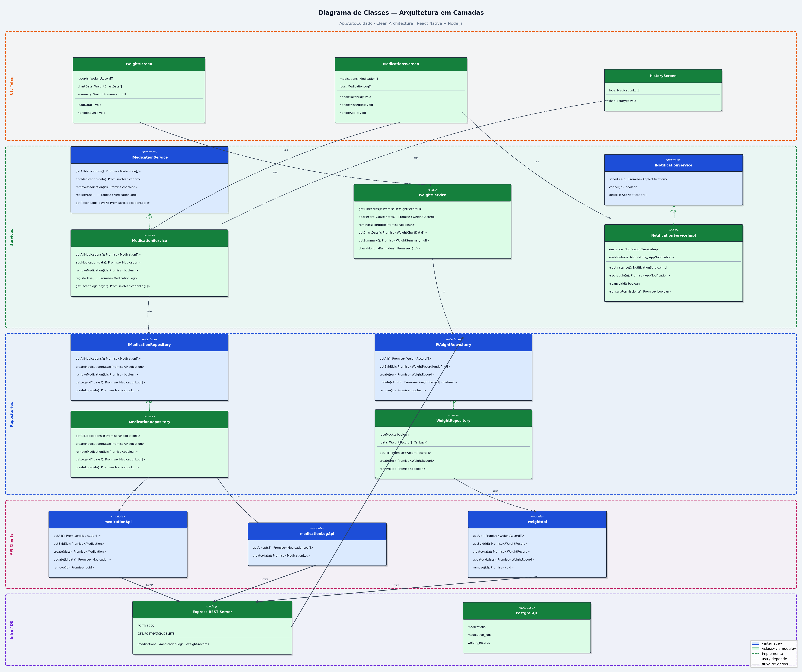
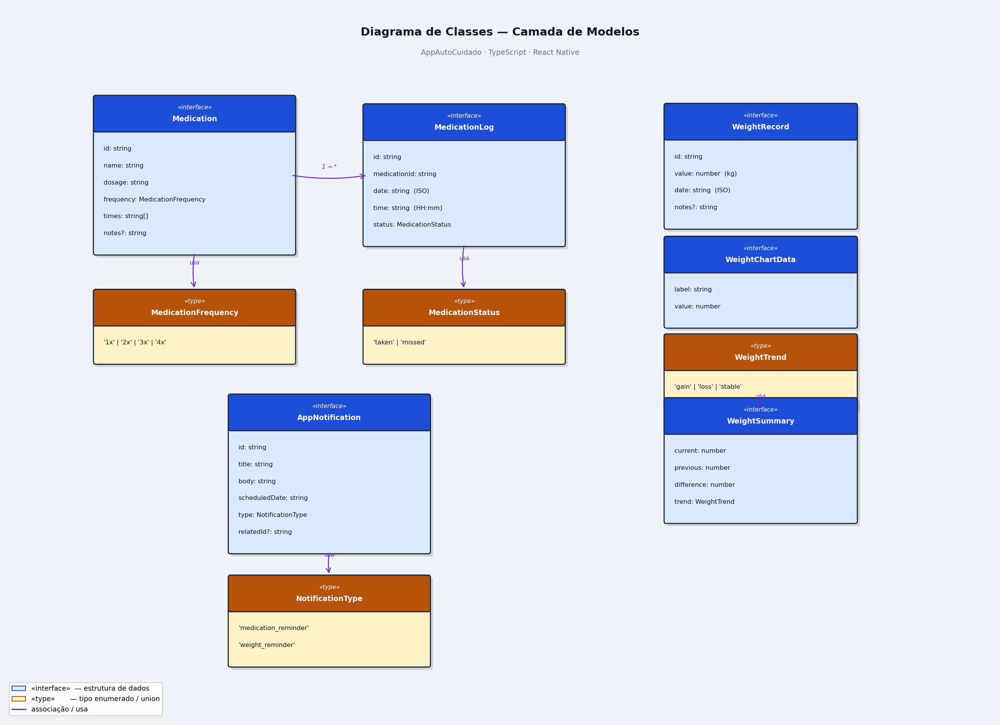
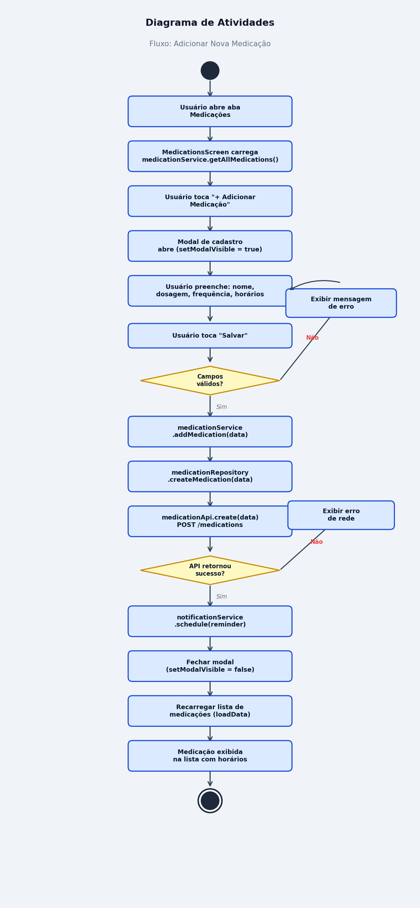
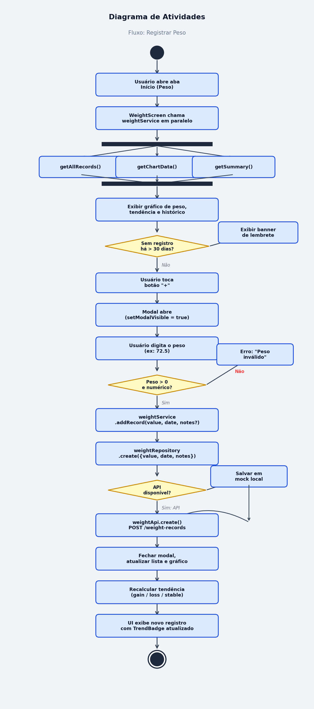
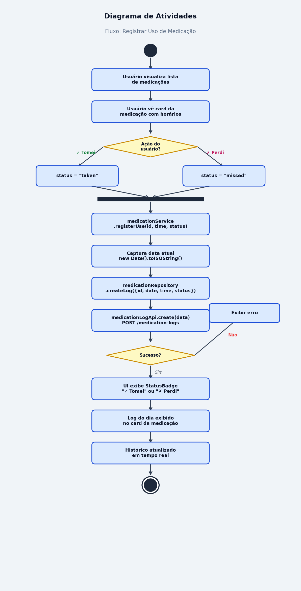

# AutoCuidado

## Documentação Técnica do Protótipo

**Documento para apresentação à equipe do cliente**  
**Finalidade:** análise de arquitetura e viabilidade de integração  
**Formato:** documentação técnica (não Presentation/PowerPoint)  
**Data:** Julho / 2026  
**Versão:** 1.0

---

## Sumário

1. [Introdução e objetivo](#1-introdução-e-objetivo)
2. [Visão geral do protótipo](#2-visão-geral-do-protótipo)
3. [Revisão dos diagramas](#3-revisão-dos-diagramas)
4. [Stack tecnológica](#4-stack-tecnológica)
5. [Arquitetura da aplicação](#5-arquitetura-da-aplicação)
6. [Endpoints da API](#6-endpoints-da-api)
7. [Fluxo de comunicação entre os módulos](#7-fluxo-de-comunicação-entre-os-módulos)
8. [Estruturas de dados](#8-estruturas-de-dados)
9. [Integrações previstas](#9-integrações-previstas)
10. [Considerações para integração com a solução do cliente](#10-considerações-para-integração-com-a-solução-do-cliente)
11. [Conclusão](#11-conclusão)
12. [Anexos](#12-anexos)

---

## 1. Introdução e objetivo

Este documento consolida a **documentação técnica do protótipo AutoCuidado**, elaborada com base nos diagramas já existentes no projeto e na implementação atual do sistema.

### Escopo deste documento

- Revisar os diagramas já criados no projeto
- Documentar a stack tecnológica utilizada
- Descrever a arquitetura da aplicação
- Listar os endpoints disponíveis na API
- Explicar o fluxo de comunicação entre os módulos
- Documentar estruturas de dados e integrações previstas
- Consolidar tudo em um único material técnico, voltado à análise de integração

### Objetivo

Fornecer uma visão técnica clara do protótipo, permitindo que a equipe do cliente avalie a **viabilidade** e a **forma de integração** com a infraestrutura já existente.

---

## 2. Visão geral do protótipo

O **AutoCuidado** é um aplicativo de monitoramento pessoal de saúde, focado em organização e adesão a hábitos de autocuidado.

### Funcionalidades do protótipo

| Módulo | Capacidade |
|--------|------------|
| **Peso** | Registro manual, histórico, gráfico de evolução e tendência (ganho / perda / estável) |
| **Medicações** | Cadastro (nome, dosagem, frequência, horários) e ações rápidas “Tomei” / “Perdi” |
| **Histórico** | Timeline unificada de eventos |
| **Notificações** | Lembretes locais no dispositivo (medicação e pesagem) |

### Componentes da solução

O protótipo é composto por três partes principais:

| Componente | Tecnologia | Função |
|------------|------------|--------|
| Aplicativo mobile | Expo / React Native / TypeScript | Interface do usuário (Android, iOS e Web) |
| API REST | Node.js / Express / Zod / Prisma | Regras de persistência e contrato HTTP/JSON |
| Banco de dados | PostgreSQL | Armazenamento relacional |

```
┌─────────────────────────────────────────────┐
│  Aplicativo Mobile (Expo / React Native)    │
│  UI → Services → Repositories → API Clients │
└──────────────────────┬──────────────────────┘
                       │  HTTP / JSON (REST)
┌──────────────────────▼──────────────────────┐
│  API REST (Express + Prisma) — porta 3001   │
└──────────────────────┬──────────────────────┘
                       │
┌──────────────────────▼──────────────────────┐
│  PostgreSQL                                 │
│  medications · medication_logs · weight_records │
└─────────────────────────────────────────────┘
```

---

## 3. Revisão dos diagramas

Os diagramas abaixo fazem parte do projeto e embasam este documento. Eles descrevem a arquitetura em camadas, os modelos de domínio e os principais fluxos de negócio.

### 3.1 Diagrama de classes — arquitetura em camadas



**O que o diagrama apresenta**

- Separação em cinco camadas: UI, Services, Repositories, API Clients e Infraestrutura
- Telas: `WeightScreen`, `MedicationsScreen`, `HistoryScreen`
- Serviços de negócio para peso, medicação e notificações
- Clients HTTP (`medicationApi`, `medicationLogApi`, `weightApi`)
- Servidor Express + PostgreSQL com as tabelas do domínio

**Leitura técnica**

A UI depende apenas dos Services. Os Services dependem dos Repositories. Os Repositories acessam a API via clients HTTP. A API persiste os dados no PostgreSQL. Esse desenho facilita a troca de implementações e a integração com outros backends.

> **Nota de implementação:** no diagrama a API aparece na porta 3000 com métodos PUT. Na base atual a API roda na porta **3001** e as atualizações usam **PATCH**.

---

### 3.2 Diagrama de classes — modelos de domínio



**Entidades e tipos representados**

| Modelo | Papel |
|--------|-------|
| `Medication` | Cadastro de medicação |
| `MedicationLog` | Registro de adesão (tomado / perdido) |
| `WeightRecord` | Registro de peso |
| `WeightSummary` / `WeightChartData` | Dados derivados para resumo e gráfico |
| `AppNotification` | Lembrete local no dispositivo |

Relacionamento principal: **1 Medication → N MedicationLog**.

---

### 3.3 Diagrama de atividades — adicionar medicação



**Resumo do fluxo**

1. Usuário abre a aba Medicações e a lista é carregada via service  
2. Abre o modal de cadastro  
3. Preenche nome, dosagem, frequência e horários  
4. Validação local dos campos  
5. Persistência via `POST /medications`  
6. Agendamento de notificação local  
7. Atualização da lista na tela  

---

### 3.4 Diagrama de atividades — registrar peso



**Resumo do fluxo**

1. Ao abrir a aba, a tela carrega registros, gráfico e resumo em paralelo  
2. Usuário informa o peso  
3. Validação (`valor > 0`)  
4. Persistência via `POST /weight-records` (com fallback local se a API estiver indisponível)  
5. Recálculo da tendência e atualização da interface  

---

### 3.5 Diagrama de atividades — registrar uso de medicação



**Resumo do fluxo**

1. Usuário visualiza o card da medicação  
2. Escolhe “Tomei” (`taken`) ou “Perdi” (`missed`)  
3. Service registra o uso  
4. Persistência via `POST /medication-logs`  
5. Interface atualiza badge e histórico  

---

## 4. Stack tecnológica

### 4.1 Aplicativo (frontend)

| Tecnologia | Versão | Função |
|------------|--------|--------|
| Expo | SDK ~54 | Toolchain de desenvolvimento e build |
| React Native | 0.81.5 | Interface multiplataforma |
| React | 19.1.0 | Componentes e estado |
| Expo Router | ~6.0 | Navegação baseada em arquivos |
| React Navigation | 7.x | Abas inferiores (bottom tabs) |
| TypeScript | ~5.9 | Tipagem estática e contratos |
| expo-notifications | ~0.32 | Notificações locais |
| OpenDyslexic | fontes locais | Acessibilidade tipográfica |

### 4.2 API (backend)

| Tecnologia | Versão | Função |
|------------|--------|--------|
| Node.js | 18+ (recomendado) | Runtime |
| Express | ^4.19 | Servidor HTTP REST |
| Prisma | ^6.19 | ORM e migrations |
| PostgreSQL | — | Banco relacional |
| Zod | ^3.25 | Validação de requisições |
| cors / dotenv | — | CORS e configuração de ambiente |

### 4.3 Itens ainda fora do protótipo

| Capacidade | Status |
|------------|--------|
| Autenticação / autorização (JWT, OAuth, SSO) | Não implementado |
| Push remoto (FCM / APNs) | Não implementado |
| Docker / orquestração | Não presente |
| Multi-usuário com isolamento por paciente | Não implementado |

Esses itens são, em geral, os primeiros pontos a alinhar na integração com a infraestrutura do cliente.

---

## 5. Arquitetura da aplicação

### 5.1 Princípios adotados

- **Arquitetura em camadas (Clean Architecture):** a interface não acessa banco nem HTTP diretamente  
- **Contratos TypeScript:** services e repositories definidos por interfaces  
- **Backend modular:** cada domínio organizado em routes → controller → service → repository → Prisma  

### 5.2 Camadas do aplicativo mobile

| Camada | Localização | Responsabilidade |
|--------|-------------|------------------|
| UI / Telas | `app/(tabs)/` | Peso, Medicações e Histórico |
| Componentes | `components/` | Button, Card, Input |
| Services | `src/services/` | Regras de negócio |
| Repositories | `src/repositories/` | Abstração de origem dos dados |
| API Clients | `src/api/` | Comunicação HTTP/JSON |
| Models | `src/models/` | Interfaces de domínio |
| Mocks | `src/mocks/` | Dados auxiliares / fallback |

### 5.3 Camadas da API

| Camada | Localização | Responsabilidade |
|--------|-------------|------------------|
| Bootstrap | `BD_SQL/server/src/app.ts` | Express, CORS, health check |
| Módulos | `src/modules/*` | medications, medication-logs, weight-records |
| Shared | `src/shared/` | Erros, middlewares, utilitários |
| Prisma | `prisma/schema.prisma` | Schema e migrations |

### 5.4 Estrutura do repositório

```
AppAutoCuidado/
├── app/                   # Telas (Expo Router)
│   └── (tabs)/            # Peso | Medicações | Histórico
├── components/            # Componentes reutilizáveis
├── src/
│   ├── api/               # Clients HTTP
│   ├── models/            # Contratos de dados
│   ├── repositories/      # Acesso a dados
│   ├── services/          # Regras de negócio
│   └── mocks/             # Dados auxiliares
├── docs/
│   ├── diagramas/         # Diagramas técnicos
│   └── DOCUMENTACAO-...   # Este documento
└── BD_SQL/server/         # API REST + Prisma + PostgreSQL
```

---

## 6. Endpoints da API

### 6.1 Informações gerais

| Item | Valor |
|------|-------|
| Base URL (desenvolvimento) | `http://localhost:3001` |
| Health check | `GET /health` → `{ "status": "ok" }` |
| Formato | JSON |
| Métodos | `GET`, `POST`, `PATCH`, `DELETE` |
| CORS (dev) | `http://localhost:8081`, `http://10.0.2.2:8081` |

**URL consumida pelo aplicativo**

| Ambiente | Endereço |
|----------|----------|
| Emulador Android | `http://10.0.2.2:3001` |
| iOS / Web | `http://localhost:3001` |
| Dispositivo físico | IP da máquina na rede local |

---

### 6.2 Medicações — `/medications`

| Método | Rota | Descrição | Status |
|--------|------|-----------|--------|
| `GET` | `/medications` | Lista medicações | 200 |
| `GET` | `/medications/:id` | Busca por UUID | 200 / 404 |
| `POST` | `/medications` | Cria medicação | 201 |
| `PATCH` | `/medications/:id` | Atualiza parcialmente | 200 |
| `DELETE` | `/medications/:id` | Remove (cascade nos logs) | 204 |

**Exemplo de body — `POST /medications`**

```json
{
  "name": "Losartana",
  "dosage": "50mg",
  "frequency": "2x",
  "times": ["08:00", "20:00"],
  "notes": "Após café"
}
```

| Campo | Tipo | Regras |
|-------|------|--------|
| `name` | string | 1 a 100 caracteres |
| `dosage` | string | 1 a 50 caracteres |
| `frequency` | enum | `1x`, `2x`, `3x` ou `4x` |
| `times` | string[] | Formato `HH:MM`; quantidade igual à frequência |
| `notes` | string \| null | Opcional; máximo 500 caracteres |

---

### 6.3 Logs de medicação — `/medication-logs`

| Método | Rota | Descrição | Status |
|--------|------|-----------|--------|
| `GET` | `/medication-logs` | Lista filtrada | 200 |
| `POST` | `/medication-logs` | Registra uso (“Tomei” / “Perdi”) | 201 |

**Query parameters — `GET /medication-logs`**

| Parâmetro | Tipo | Descrição |
|-----------|------|-----------|
| `days` | inteiro positivo (opcional) | Janela de dias |
| `medicationId` | UUID (opcional) | Filtra por medicação |

**Exemplo de body — `POST /medication-logs`**

```json
{
  "medicationId": "550e8400-e29b-41d4-a716-446655440000",
  "date": "2026-07-14",
  "time": "08:00",
  "status": "taken"
}
```

| Campo | Tipo | Regras |
|-------|------|--------|
| `medicationId` | UUID | Deve existir em `medications` |
| `date` | string | `YYYY-MM-DD` |
| `time` | string | `HH:MM` |
| `status` | enum | `taken` ou `missed` |

---

### 6.4 Registros de peso — `/weight-records`

| Método | Rota | Descrição | Status |
|--------|------|-----------|--------|
| `GET` | `/weight-records` | Lista registros | 200 |
| `GET` | `/weight-records/:id` | Busca por UUID | 200 / 404 |
| `POST` | `/weight-records` | Cria registro | 201 |
| `PATCH` | `/weight-records/:id` | Atualiza parcialmente | 200 |
| `DELETE` | `/weight-records/:id` | Remove | 204 |

**Exemplo de body — `POST /weight-records`**

```json
{
  "value": 72.5,
  "date": "2026-07-14",
  "notes": "Manhã, em jejum"
}
```

| Campo | Tipo | Regras |
|-------|------|--------|
| `value` | number | Obrigatório; deve ser maior que zero |
| `date` | string | Opcional; `YYYY-MM-DD` |
| `notes` | string \| null | Opcional; máximo 500 caracteres |

**Resposta típica**

```json
{
  "id": "uuid",
  "value": 72.5,
  "date": "2026-07-14",
  "notes": "Manhã, em jejum"
}
```

---

### 6.5 Tratamento de erros

| Situação | HTTP | Corpo |
|----------|------|-------|
| Erro de negócio | 400 / 404 | `{ "error": "mensagem" }` |
| Validação (Zod) | 400 | `{ "error": "...", "details": [{ "field", "message" }] }` |
| Registro não encontrado | 404 | `{ "error": "..." }` |
| Erro interno | 500 | `{ "error": "Erro interno no servidor." }` |

---

## 7. Fluxo de comunicação entre os módulos

### 7.1 Fluxo padrão (app → API → banco)

```
Tela
  → Service (regra de negócio)
    → Repository (abstração de dados)
      → API Client (HTTP / JSON)
        → Express (routes → controller → service → repository)
          → Prisma
            → PostgreSQL
```

### 7.2 Fluxo de notificações

```
MedicationsScreen → notificationService → sistema operacional do dispositivo
```

As notificações são **locais**. Não há persistência de agenda de notificações no PostgreSQL neste protótipo.

### 7.3 Comunicação por módulo de tela

| Tela | Entrada do usuário | Caminho interno | Endpoint |
|------|--------------------|-----------------|----------|
| Medicações | Cadastro | Service → Repository → `medicationApi` | `POST /medications` |
| Medicações | Tomei / Perdi | Service → Repository → `medicationLogApi` | `POST /medication-logs` |
| Peso | Novo registro | Service → Repository → `weightApi` | `POST /weight-records` |
| Histórico | Visualização | Service de medicações (+ peso) | `GET /medication-logs` / `GET /weight-records` |

### 7.4 Comportamento de disponibilidade da API

| Módulo | Se a API estiver indisponível |
|--------|-------------------------------|
| Peso | Fallback para dados mock em memória |
| Medicações | Sem fallback — requer API |
| Notificações | Continuam locais no aparelho |

---

## 8. Estruturas de dados

### 8.1 Modelos de domínio (TypeScript)

#### Medication

| Campo | Tipo | Descrição |
|-------|------|-----------|
| `id` | string (UUID) | Identificador |
| `name` | string | Nome do medicamento |
| `dosage` | string | Dosagem (ex.: `50mg`) |
| `frequency` | `1x` \| `2x` \| `3x` \| `4x` | Frequência diária |
| `times` | string[] | Horários no formato `HH:mm` |
| `notes` | string (opcional) | Observações |

#### MedicationLog

| Campo | Tipo | Descrição |
|-------|------|-----------|
| `id` | string (UUID) | Identificador |
| `medicationId` | string (UUID) | Medicação relacionada |
| `date` | string | Data (`YYYY-MM-DD`) |
| `time` | string | Horário (`HH:mm`) |
| `status` | `taken` \| `missed` | Situação do uso |

#### WeightRecord

| Campo | Tipo | Descrição |
|-------|------|-----------|
| `id` | string (UUID) | Identificador |
| `value` | number | Peso em kg |
| `date` | string | Data do registro |
| `notes` | string (opcional) | Observações |

#### WeightSummary (calculado no service)

| Campo | Tipo | Descrição |
|-------|------|-----------|
| `current` | number | Peso atual |
| `previous` | number | Peso anterior |
| `difference` | number | Diferença |
| `trend` | `gain` \| `loss` \| `stable` | Tendência |

#### AppNotification (somente dispositivo)

| Campo | Tipo | Descrição |
|-------|------|-----------|
| `id` | string | Identificador |
| `title` | string | Título |
| `body` | string | Conteúdo |
| `scheduledDate` | string | Data/hora agendada |
| `type` | `medication_reminder` \| `weight_reminder` | Tipo |
| `relatedId` | string (opcional) | Referência ao domínio |

---

### 8.2 Modelo relacional (PostgreSQL)

```
medications
───────────
id            UUID PK
name          VARCHAR(100)
dosage        VARCHAR(50)
frequency     VARCHAR(5)
times         TEXT[]
notes         TEXT?

medication_logs
───────────────
id              UUID PK
medication_id   UUID FK → medications (ON DELETE CASCADE)
date            DATE
time            VARCHAR(5)
status          VARCHAR(10)
índices: medication_id, date DESC

weight_records
──────────────
id      UUID PK
value   DECIMAL
date    DATE DEFAULT CURRENT_DATE
notes   TEXT?
```

### 8.3 Relacionamentos

```
Medication ──── 1:N ──── MedicationLog
WeightRecord               (entidade independente)
AppNotification            (local no dispositivo)
```

---

## 9. Integrações previstas

### 9.1 Integrações já presentes no protótipo

| Integração | Como está implementada |
|------------|------------------------|
| Persistência | PostgreSQL via Prisma |
| Contrato de dados | API REST em JSON |
| Comunicação app ↔ API | HTTP `fetch` |
| Notificações | Locais (`expo-notifications`) |
| Validação de entrada | Zod nos endpoints |

### 9.2 Integrações a definir com o cliente

| Tema | Situação atual do protótipo | Decisão necessária na integração |
|------|-----------------------------|----------------------------------|
| Autenticação | Sem login | SSO, JWT, API Key ou outro padrão do cliente |
| Identidade do paciente | Sem `userId` / `patientId` | Incluir escopo por usuário/paciente |
| Gateway / Base URL | URL local hardcoded | Expor via gateway HTTPS do cliente |
| CORS / rede | Restrito ao ambiente Expo local | Liberar origens oficiais |
| Push | Apenas notificação local | Avaliar FCM/APNs ou serviço corporativo |
| Padrão de API | REST/JSON próprio | Adapter/BFF se o cliente usar outro contrato |
| Segurança em trânsito | HTTP local | TLS/HTTPS em ambiente do cliente |
| Observabilidade | Health check básico | APM, logs e auditoria alinhados ao cliente |

### 9.3 Variáveis de ambiente da API

| Variável | Função |
|----------|--------|
| `POSTGRES_HOST` | Host do banco |
| `POSTGRES_PORT` | Porta do banco |
| `POSTGRES_DB` | Nome do banco |
| `POSTGRES_USER` | Usuário |
| `POSTGRES_PASSWORD` | Senha |
| `API_PORT` | Porta da API (padrão `3001`) |
| `DATABASE_URL` | Connection string (opcional; pode ser montada automaticamente) |
| `NODE_ENV` | Ambiente (`development` / `production` / `test`) |

---

## 10. Considerações para integração com a solução do cliente

### 10.1 Superfície de integração recomendada

A forma mais direta de integrar o protótipo à infraestrutura existente é consumir (ou espelhar) os recursos REST:

- `GET/POST/PATCH/DELETE /medications`
- `GET/POST /medication-logs`
- `GET/POST/PATCH/DELETE /weight-records`
- `GET /health`

Essa superfície é estável, tipada e independente da camada visual do aplicativo.

### 10.2 Caminhos possíveis de integração

| Abordagem | Descrição |
|-----------|-----------|
| **A — API do protótipo atrás do gateway do cliente** | Expor a API atual com autenticação, HTTPS e políticas de rede do cliente |
| **B — Adapter / BFF** | Manter o app e traduzir o contrato REST atual para a API já existente no cliente |
| **C — Persistência unificada** | Mapear as tabelas do protótipo para o modelo de dados corporativo (com vínculo de paciente/usuário) |

### 10.3 Limitações atuais a considerar na avaliação

1. Ausência de autenticação e isolamento por usuário  
2. Notificações apenas locais (sem sincronização entre dispositivos)  
3. Fallback offline parcial (presente sobretudo no módulo de peso)  
4. Deploy sem Docker; depende do padrão de hospedagem do cliente  
5. Evolução natural do modelo: inclusão de `patientId` / `userId` e auditoria  

---

## 11. Conclusão

O protótipo AutoCuidado entrega uma solução técnica clara e modular, composta por:

- aplicativo mobile em **React Native / Expo**
- API REST em **Node.js / Express**
- persistência em **PostgreSQL**
- arquitetura em camadas, documentada pelos diagramas do projeto

A documentação acima permite à equipe do cliente:

1. compreender a stack e o desenho arquitetural  
2. avaliar os endpoints e as estruturas de dados  
3. identificar pontos de integração com a infraestrutura existente  
4. decidir o melhor caminho de encaixe (gateway, adapter/BFF ou unificação de modelo)

Os principais pontos de alinhamento para a próxima etapa técnica são: **autenticação**, **identidade do paciente/usuário**, **exposição HTTPS via gateway** e **estratégia de notificações** (local versus push corporativo).

---

## 12. Anexos

### Anexo A — Diagramas do projeto

| Arquivo | Conteúdo |
|---------|----------|
| `docs/diagramas/class_architecture.png` | Arquitetura em camadas |
| `docs/diagramas/class_models.png` | Modelos de domínio |
| `docs/diagramas/activity_add_medication.png` | Fluxo de cadastro de medicação |
| `docs/diagramas/activity_record_weight.png` | Fluxo de registro de peso |
| `docs/diagramas/activity_register_use.png` | Fluxo de registro de uso |

### Anexo B — Referências internas do repositório

| Documento | Conteúdo |
|-----------|----------|
| `docs/README-TECHNICAL.md` | Documentação técnica de apoio |
| `COMO_RODAR.md` | Guia de execução local |
| `docs/README-MVP.md` | Escopo funcional do MVP |
| `docs/README-PITCH.md` | Contexto de produto |
| `BD_SQL/server/prisma/schema.prisma` | Schema do banco |

### Anexo C — Catálogo rápido de endpoints

| Método | Rota |
|--------|------|
| `GET` | `/health` |
| `GET` | `/medications` |
| `GET` | `/medications/:id` |
| `POST` | `/medications` |
| `PATCH` | `/medications/:id` |
| `DELETE` | `/medications/:id` |
| `GET` | `/medication-logs` |
| `POST` | `/medication-logs` |
| `GET` | `/weight-records` |
| `GET` | `/weight-records/:id` |
| `POST` | `/weight-records` |
| `PATCH` | `/weight-records/:id` |
| `DELETE` | `/weight-records/:id` |

---

*Fim do documento — AutoCuidado · Documentação Técnica do Protótipo · v1.0*
